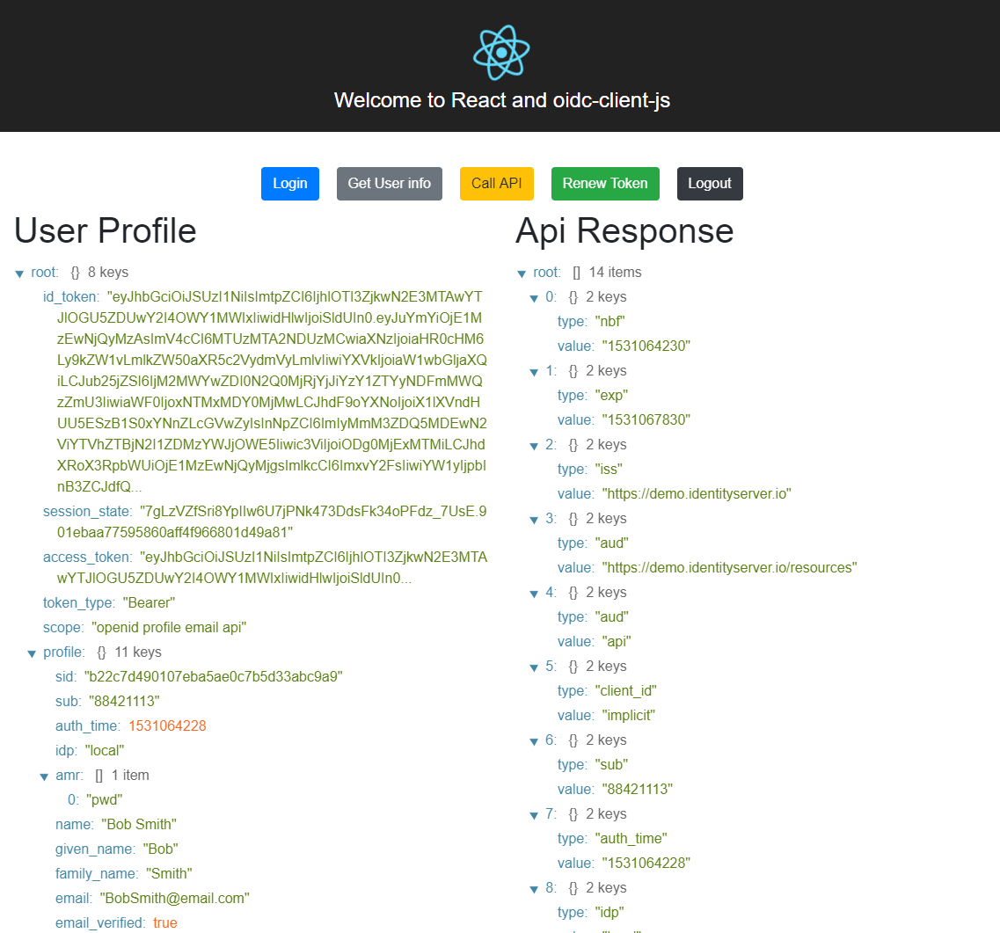

# React-oidc-client-js

> OpenID Connect (OIDC) client with React and typescript

- This is sample application that contains [oidc-client-js](https://github.com/IdentityModel/oidc-client-js) and `React` with `Typescript`.

- The application is based on `create-react-app` - [Create React App](https://github.com/facebook/create-react-app)

## ℹ️ Project status: Not maintained

This project is no longer maintained.

It demonstrates a legacy approach where access tokens are stored in
`localStorage` / `sessionStorage`, which is **no longer considered secure**
for modern SPA applications.

👉 **Current recommendation:**  
Use the **Backend for Frontend (BFF) pattern**, where tokens are handled
server-side and never exposed to the browser.

# Installation

## Cloning app

- `git clone https://github.com/skoruba/react-oidc-client-js.git`
- `cd src/`

## Install dependecies

- Install dependecies - `yarn install`

## Running app

- `yarn start` - start the web server that is running on [http://localhost:4200](http://localhost:4200)

- The application is connected to `OpenID Connect Provider` that is running on [https://demo.identityserver.io/](https://demo.identityserver.io/)
- This STS has configured a SPA client to run on http://localhost:4200, therefore a sample application will be running on this port `4200`.

## App preview

